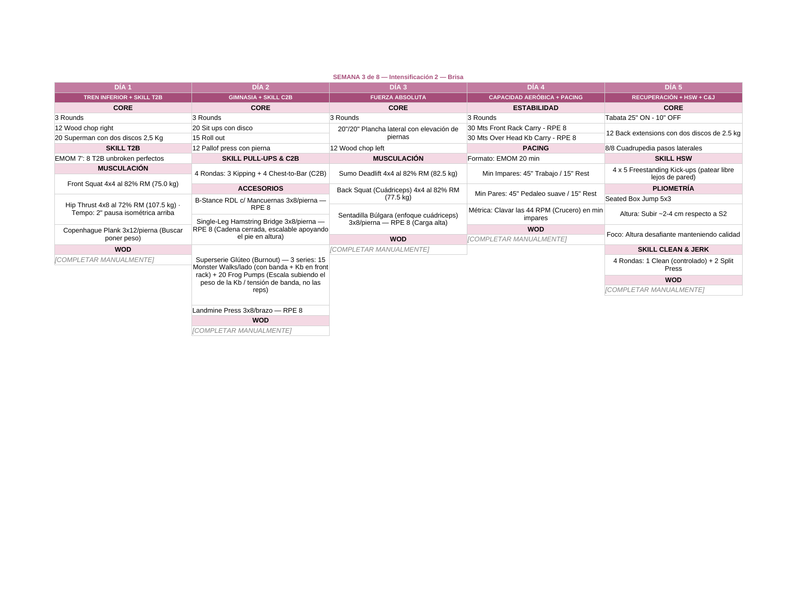
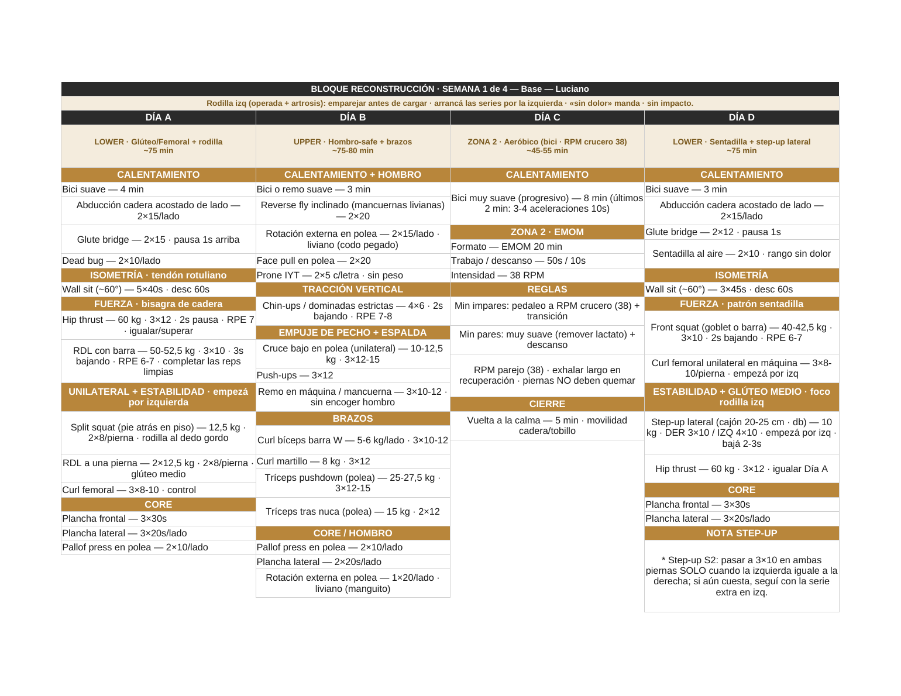
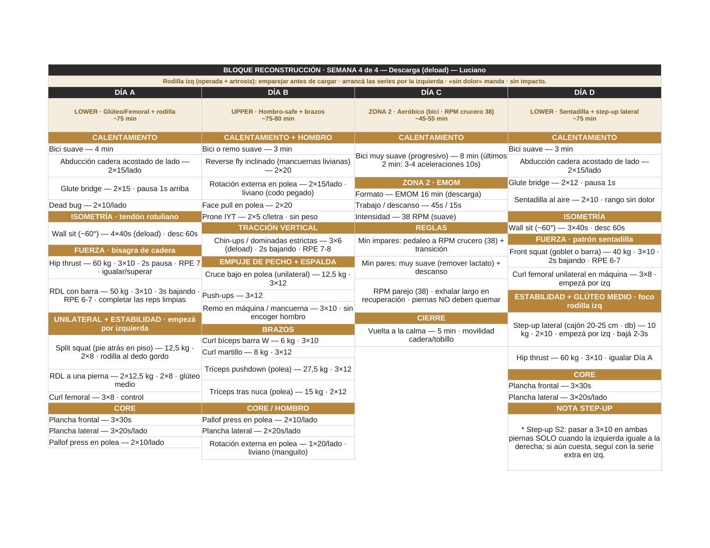
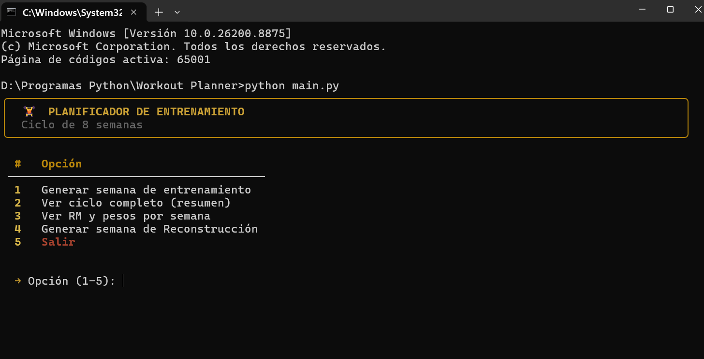
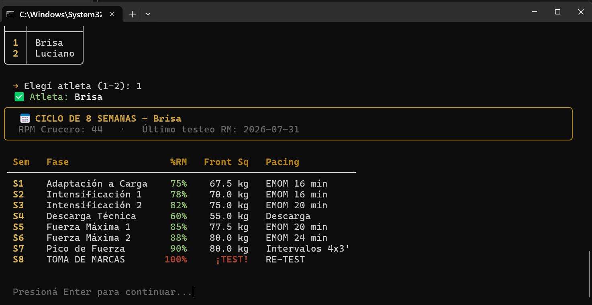
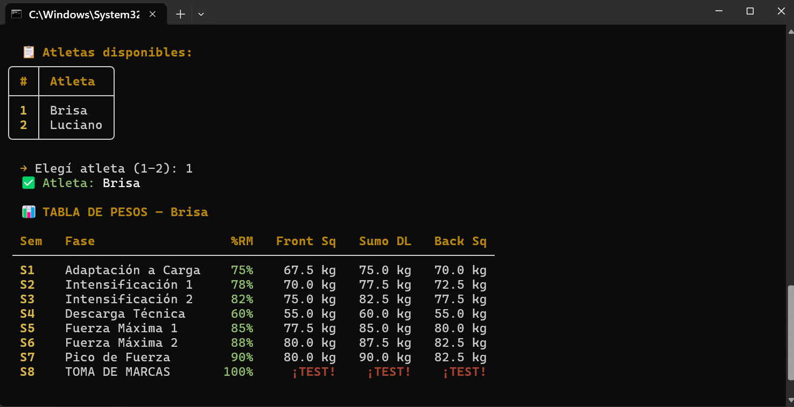
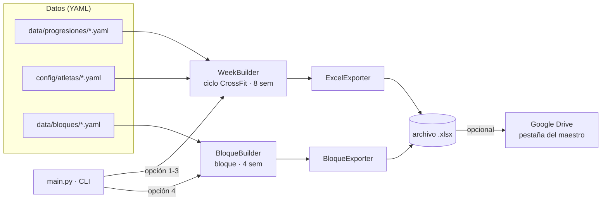

<h1 align="center">🏋️ Workout Planner</h1>

<p align="center">
  <strong>Generador de planes de entrenamiento periodizados en Excel — data-driven, desde la consola.</strong><br/>
  <em>Data-driven CLI that generates periodized training plans as polished Excel files.</em>
</p>

<p align="center">
  
  
  
  
  
  
</p>

<p align="center">
  <a href="#-español">🇦🇷 Español</a> · <a href="#-english">🇬🇧 English</a>
</p>

<p align="center">
  
</p>

---

## 📸 Capturas / Screenshots

| Ciclo CrossFit (tema *rosa*) | Bloque Reconstrucción · S1 (tema *arena*) | Bloque Reconstrucción · S4 *deload* |
|:---:|:---:|:---:|
|  |  |  |
| 5 días · fuerza por %RM · skills + pacing | 4 días · cargas por semana · foco rodilla | misma semana en descarga (menos volumen) |

### La consola / The CLI

Interfaz de terminal con [`rich`](https://github.com/Textualize/rich) y una **paleta dorada** uniforme. *Terminal UI powered by `rich` with a consistent golden palette.*

| Menú principal / Main menu | Ver ciclo completo / Full cycle | RM y pesos / 1RM & loads |
|:---:|:---:|:---:|
|  |  |  |
| paneles y tablas · color por rol | panel + tabla por semana | pesos por %RM · TEST en rojo |

---

## 🧩 Arquitectura / Architecture



El proyecto tiene **dos motores independientes** que comparten el mismo estilo de exportación a Excel. *Two independent engines share the same Excel export style.*

---

## 🗂️ Estructura / Project structure

```text
Workout-planner/
├── main.py                          # CLI (menú principal · UI con rich: paneles, tablas, paleta dorada)
├── requirements.txt
├── config/
│   └── atletas/                     # Perfiles de atleta (RM, RPM crucero)
│       ├── novia.yaml               # Brisa
│       └── yo.yaml                  # Luciano
├── data/
│   ├── core_catalog.yaml            # Catálogo de ejercicios de core
│   ├── progresiones/                # Progresiones del ciclo CrossFit (8 semanas)
│   │   ├── strength.yaml            #   fuerza base por %RM
│   │   ├── hip_thrust.yaml
│   │   ├── acompanantes.yaml
│   │   ├── accesorios.yaml
│   │   ├── gimnasticos.yaml         #   T2B / C2B / HSW
│   │   ├── pliometria.yaml
│   │   └── pacing.yaml              #   zona 2 / EMOM
│   └── bloques/                     # Bloques data-driven
│       └── reconstruccion.yaml      #   Bloque Reconstrucción (4 semanas)
├── src/
│   ├── models.py                    # Dataclasses del ciclo CrossFit
│   ├── week_builder.py              # Motor del ciclo CrossFit
│   ├── core_selector.py             # Selección inteligente de core (sin repetir)
│   ├── rm_calculator.py             # %RM → kg (redondeo a 2.5 kg)
│   ├── progression_loader.py        # Carga de los YAML de progresión
│   ├── excel_exporter.py            # Exportador Excel + temas de color
│   ├── bloque_models.py             # Dataclasses de bloques
│   ├── bloque_builder.py            # Motor de bloques (data-driven)
│   ├── bloque_exporter.py           # Exportador de bloques (reutiliza estilos)
│   └── drive_uploader.py            # Subida a Google Drive como pestaña
├── tests/
│   ├── test_week_builder.py         # 31 tests
│   ├── test_rm_calculator.py        # 11 tests
│   └── test_bloque_reconstruccion.py# 10 tests
└── output/                          # Excels generados (git-ignored)
```

---

## ⚙️ Instalación / Installation

```bash
# 1. Clonar / Clone
git clone https://github.com/LucianoTito/Workout-planner.git
cd Workout-planner

# 2. (opcional) entorno virtual / virtual env
python -m venv .venv && source .venv/bin/activate   # Windows: .venv\Scripts\activate

# 3. Dependencias / Dependencies
pip install -r requirements.txt

# 4. Ejecutar / Run
python main.py
```

> La subida a Google Drive es **opcional**. Requiere `credentials.json` (OAuth) y solo se activa si elegís subir. Sin eso, el Excel igual se genera localmente en `output/`.
> Google Drive upload is **optional** — it needs `credentials.json` and only runs on demand. Without it, the Excel is still generated locally.

---

## 🇦🇷 Español

### ¿Qué es?

**Workout Planner** es una herramienta de línea de comandos que arma planes de entrenamiento **periodizados** y los exporta a Excel con formato profesional, listos para compartir. Nació para automatizar la planificación semanal de dos personas reales y evitar armar cada planilla a mano.

Toda la lógica de entrenamiento vive en **archivos YAML** (progresiones, cargas, catálogos), así que ajustar el plan no requiere tocar código: se edita el YAML y listo.

### ✨ Características

- **Dos programas en una sola app:**
  - 🔴 **Ciclo CrossFit (8 semanas):** fuerza calculada por **% de RM** (redondeo automático a 2,5 kg), skills gimnásticos (T2B / C2B / HSW), *pacing* de zona 2, pliometría y batería de accesorios.
  - 🟤 **Bloque Reconstrucción (4 semanas):** rehabilitación con cargas fijas por semana y **descarga (*deload*) en la S4**, pensado para volver de una lesión de rodilla.
- **Selector inteligente de core:** elige ejercicios según el día, sin repetir en la semana y evitando fatigar los grupos ya trabajados (reproducible con *seed*).
- **Exportación a Excel prolija:** temas de color por atleta (*rosa* / *arena*), combinación vertical automática para textos largos, bloques vacíos omitidos y un área de **NOTAS** libre.
- **Consola con estilo:** interfaz de terminal con [`rich`](https://github.com/Textualize/rich) — paneles, tablas y una **paleta dorada** uniforme, con color por rol (títulos, opciones, %RM, avisos y errores).
- **Distribución flexible:** el ciclo se adapta a **3, 4 o 5 días** por semana.
- **Integración con Google Drive:** sube la semana como una **pestaña** dentro del Sheets "maestro" del atleta, con red de seguridad para no pisar pestañas editadas a mano.
- **52 tests** que cubren cálculos, progresiones y exportación.

### Los dos programas

| | Ciclo CrossFit | Bloque Reconstrucción |
|---|---|---|
| Duración | 8 semanas | 4 semanas (deload en S4) |
| Cargas | calculadas por %RM del atleta | literales por semana (YAML) |
| Días | A · B · C · D · E (3-5 días) | A · B · C · D |
| Datos | `data/progresiones/*.yaml` + `config/atletas/*.yaml` | `data/bloques/*.yaml` |
| Motor | `week_builder.py` | `bloque_builder.py` |

> El bloque se implementó como **carril data-driven aparte** para no tocar el motor CrossFit ni sus tests.

### ▶️ Uso

Al ejecutar `python main.py`:

```text
  1 │ Generar semana de entrenamiento      → ciclo CrossFit (8 semanas)
  2 │ Ver ciclo completo (resumen)
  3 │ Ver RM y pesos por semana
  4 │ Generar semana de Reconstrucción     → bloque (4 semanas)
  5 │ Salir
```

El menú, las tablas y los *previews* se dibujan con `rich` en una **paleta dorada** uniforme. El flujo te pide el atleta, la semana y la fecha de inicio, muestra un *preview* en consola y ofrece exportar a Excel (y, si querés, subir a Drive).

### ✏️ Editar o agregar ejercicios

Todo el bloque de reconstrucción se define en `data/bloques/reconstruccion.yaml`. Para cambiar cargas o sumar ejercicios **no hace falta tocar código**:

```yaml
- header: "FUERZA · bisagra de cadera"
  ejercicios:
    - nombre: "Hip thrust"
      nota: "2s pausa · RPE 7 · igualar/superar"   # cue fijo (todas las semanas)
      semanas:                                       # una carga por semana
        - "60 kg · 3×12"     # S1
        - "62,5 kg · 3×12"   # S2
        - "65 kg · 3×10-12"  # S3
        - "60 kg · 3×10"     # S4 (deload)
```

- `items:` → líneas fijas (calentamiento, core, notas).
- `ejercicios:` → líneas que cambian por semana (`semanas: [S1, S2, S3, S4]`).

### 🧪 Tests

```bash
python tests/test_week_builder.py          # motor CrossFit
python tests/test_rm_calculator.py         # cálculo de %RM → kg
python tests/test_bloque_reconstruccion.py # bloque data-driven
```

### 🛣️ Ideas a futuro

- Más bloques data-driven (hipertrofia, fuerza pura) reusando el mismo motor.
- Perfiles de atleta editables desde el propio CLI.
- Export a PDF además de Excel.

---

## 🇬🇧 English

### What is it?

**Workout Planner** is a command-line tool that builds **periodized** training plans and exports them to polished Excel files, ready to share. It was born to automate weekly planning for two real people and avoid building each spreadsheet by hand.

All training logic lives in **YAML files** (progressions, loads, catalogs), so tweaking a plan never requires touching code — you edit the YAML and you're done.

### ✨ Features

- **Two programs in one app:**
  - 🔴 **CrossFit cycle (8 weeks):** strength driven by **% of 1RM** (auto-rounded to 2.5 kg), gymnastic skills (T2B / C2B / HSW), zone-2 *pacing*, plyometrics and an accessory battery.
  - 🟤 **Reconstruction block (4 weeks):** rehab-oriented, fixed weekly loads with a **deload on week 4**, designed to come back from a knee injury.
- **Smart core selector:** picks exercises per day, never repeats within a week and avoids fatiguing already-worked groups (reproducible via seed).
- **Clean Excel export:** per-athlete color themes (*rosa* / *arena*), automatic vertical merging for long text, empty blocks skipped and a free **NOTES** area.
- **Styled console:** [`rich`](https://github.com/Textualize/rich)-powered terminal UI — panels, tables and a consistent **golden palette**, color-coded by role (titles, options, %RM, warnings and errors).
- **Flexible split:** the cycle adapts to **3, 4 or 5 days** per week.
- **Google Drive integration:** uploads the week as a **tab** inside the athlete's "master" Sheet, with a safety net so hand-edited tabs aren't overwritten.
- **52 tests** covering calculations, progressions and export.

### The two programs

| | CrossFit cycle | Reconstruction block |
|---|---|---|
| Length | 8 weeks | 4 weeks (deload on W4) |
| Loads | computed from athlete's %RM | literal per week (YAML) |
| Days | A · B · C · D · E (3-5 days) | A · B · C · D |
| Data | `data/progresiones/*.yaml` + `config/atletas/*.yaml` | `data/bloques/*.yaml` |
| Engine | `week_builder.py` | `bloque_builder.py` |

> The block was implemented as a **separate data-driven track** so the CrossFit engine and its tests stay untouched.

### ▶️ Usage

Running `python main.py`:

```text
  1 │ Generate training week            → CrossFit cycle (8 weeks)
  2 │ View full cycle (summary)
  3 │ View 1RM and weekly loads
  4 │ Generate Reconstruction week      → block (4 weeks)
  5 │ Exit
```

The menu, tables and previews are rendered with `rich` in a consistent **golden palette**. The flow asks for the athlete, the week and the start date, shows a console preview and offers to export to Excel (and optionally upload to Drive).

### ✏️ Editing or adding exercises

The whole reconstruction block is defined in `data/bloques/reconstruccion.yaml`. Changing loads or adding exercises **requires no code changes**:

```yaml
- header: "FUERZA · bisagra de cadera"
  ejercicios:
    - nombre: "Hip thrust"
      nota: "2s pausa · RPE 7 · igualar/superar"   # fixed cue (every week)
      semanas:                                       # one load per week
        - "60 kg · 3×12"     # W1
        - "62,5 kg · 3×12"   # W2
        - "65 kg · 3×10-12"  # W3
        - "60 kg · 3×10"     # W4 (deload)
```

- `items:` → fixed lines (warm-up, core, notes).
- `ejercicios:` → lines that change per week (`semanas: [W1, W2, W3, W4]`).

### 🧪 Tests

```bash
python tests/test_week_builder.py          # CrossFit engine
python tests/test_rm_calculator.py         # %RM → kg calculation
python tests/test_bloque_reconstruccion.py # data-driven block
```

### 🛣️ Roadmap

- More data-driven blocks (hypertrophy, pure strength) reusing the same engine.
- Athlete profiles editable straight from the CLI.
- PDF export in addition to Excel.

---

## 👤 Autor / Author

**Luciano Facundo Tito Cedrón** — Backend Developer Jr. (.NET · C# · SQL Server) & Python enthusiast.

<p>
  <a href="https://github.com/LucianoTito"></a>
  <a href="https://linkedin.com/in/luciano-tito-cedron"></a>
  <a href="https://portfolio-luciano-tito-cedron.netlify.app"></a>
  <a href="mailto:lucianotitocedron@gmail.com"></a>
</p>

---

## 📄 Licencia / License

Proyecto personal con fines educativos y de portfolio. *Personal project for educational / portfolio purposes.*
